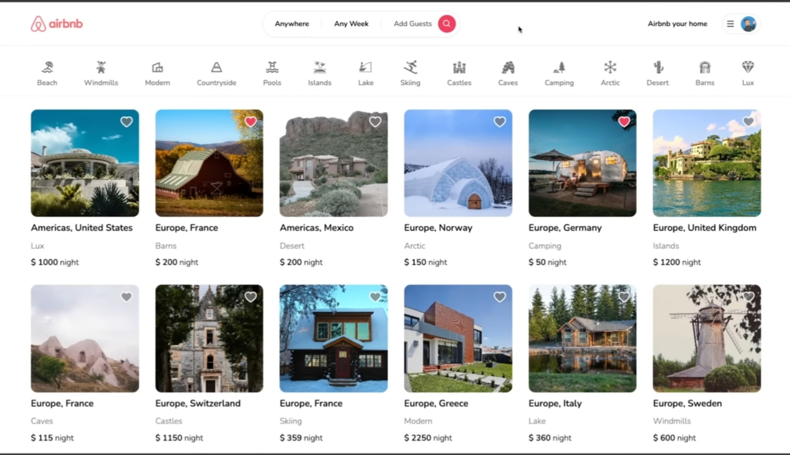
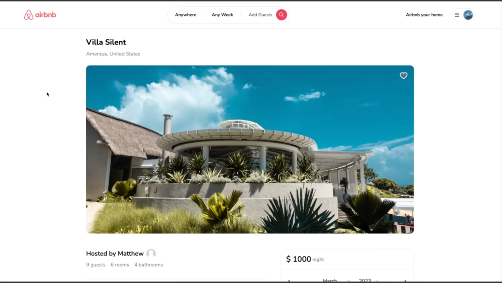

# Fullstack Booking Platform

Airbnb-inspired fullstack booking platform built with Next.js 13 App Router.

## Tech Stack

* Next.js 14
* React
* TypeScript
* Prisma
* MongoDB
* NextAuth
* Tailwind CSS

## Features

* User authentication
* Property listing
* Booking system
* Search functionality
* Favorite properties
* Responsive design

## Overview

This project is a fullstack booking platform inspired by Airbnb.

Users can:

* Create accounts
* Login securely
* Add property listings
* Search properties
* Make reservations

## Technical Highlights

* SSR with Next.js App Router
* Authentication using NextAuth
* Database access with Prisma ORM
* MongoDB integration
* Responsive UI design

## Screenshots

## Demo

Deployment currently unavailable.

## Known Issues

Some third-party services may not work properly due to free-tier limitations.

## Project Status

This project is mainly for portfolio and technical demonstration purposes.

Some pages or UI sections may not be fully available in the deployed version due to deployment environment, database connection, authentication settings, or free-tier service limitations.

Screenshots are included to demonstrate the main UI and application flow.
